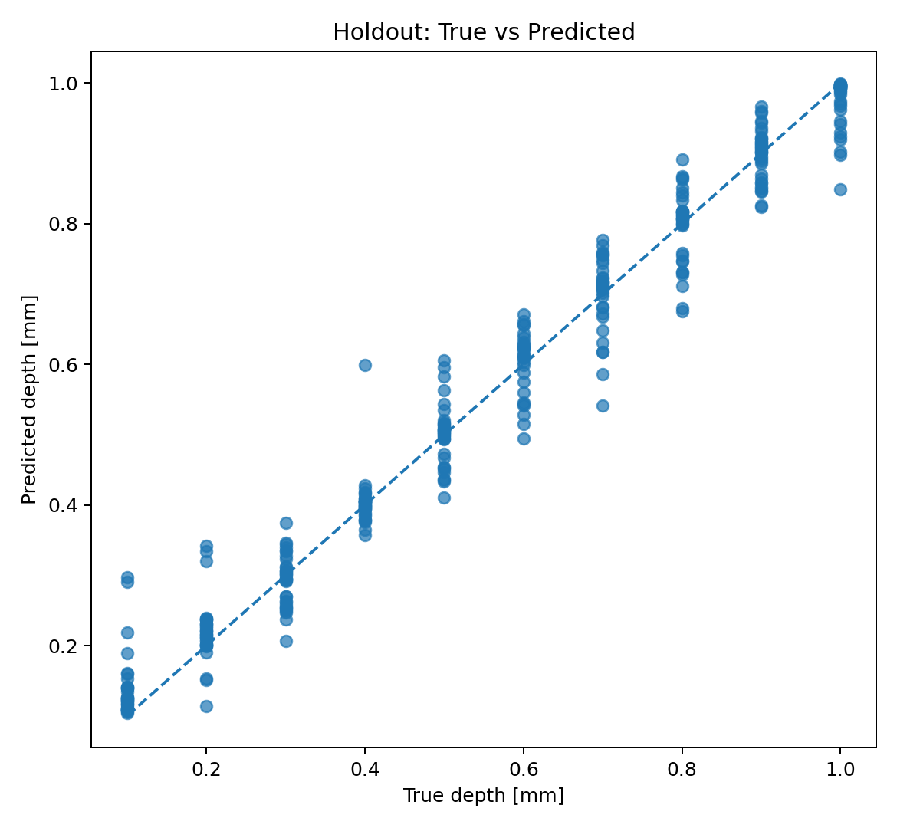
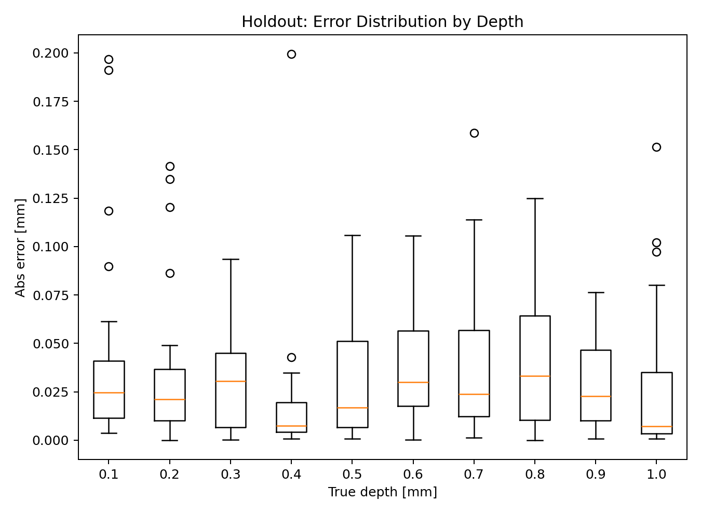
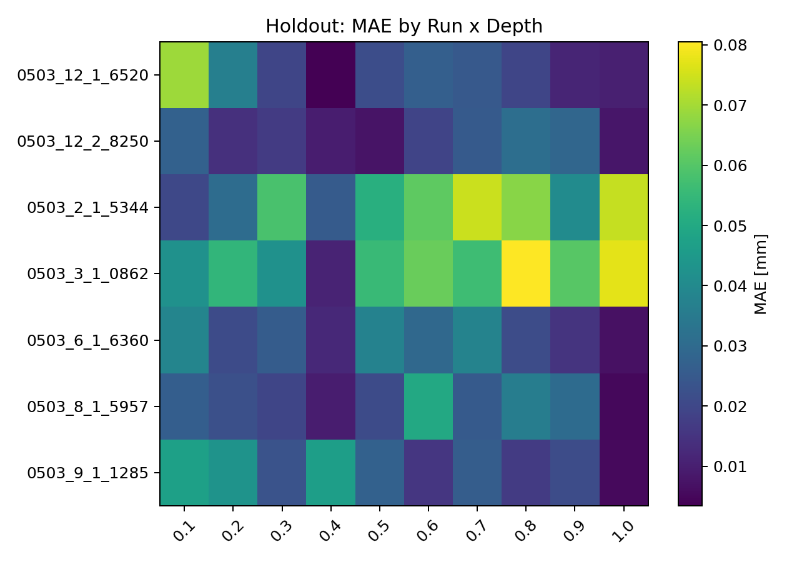
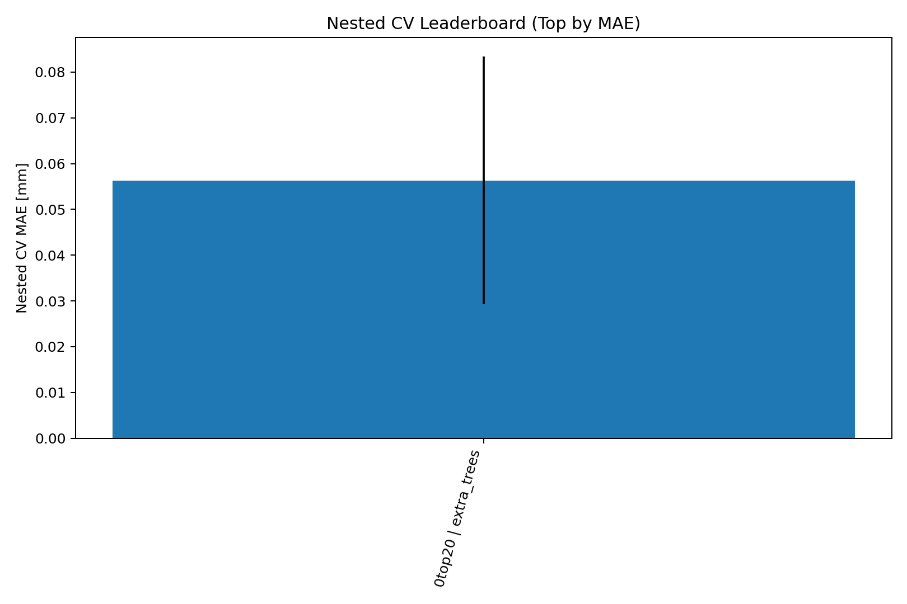
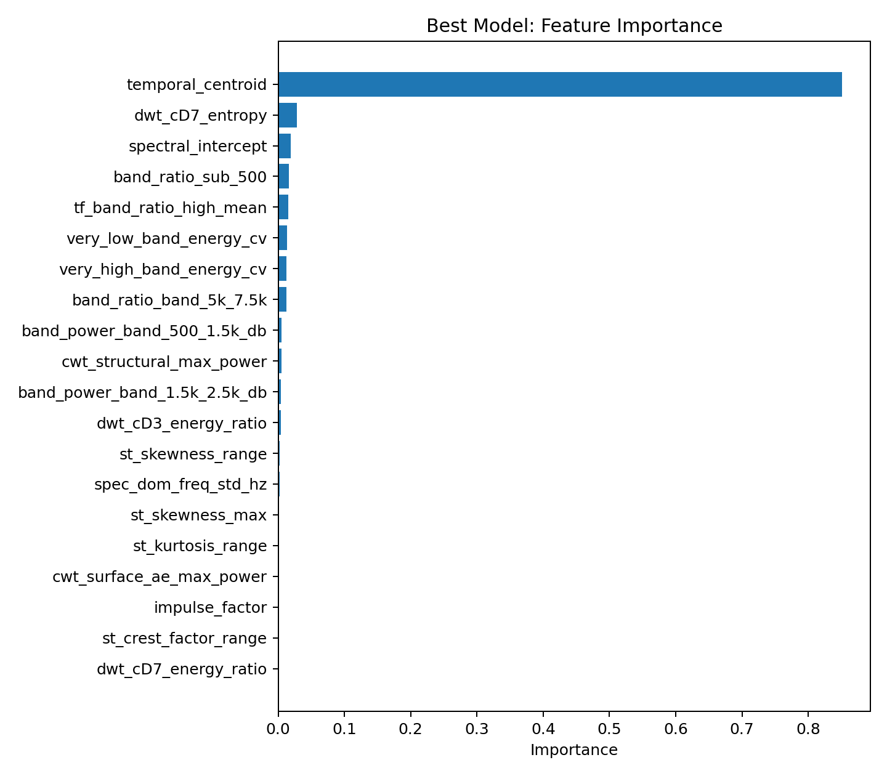
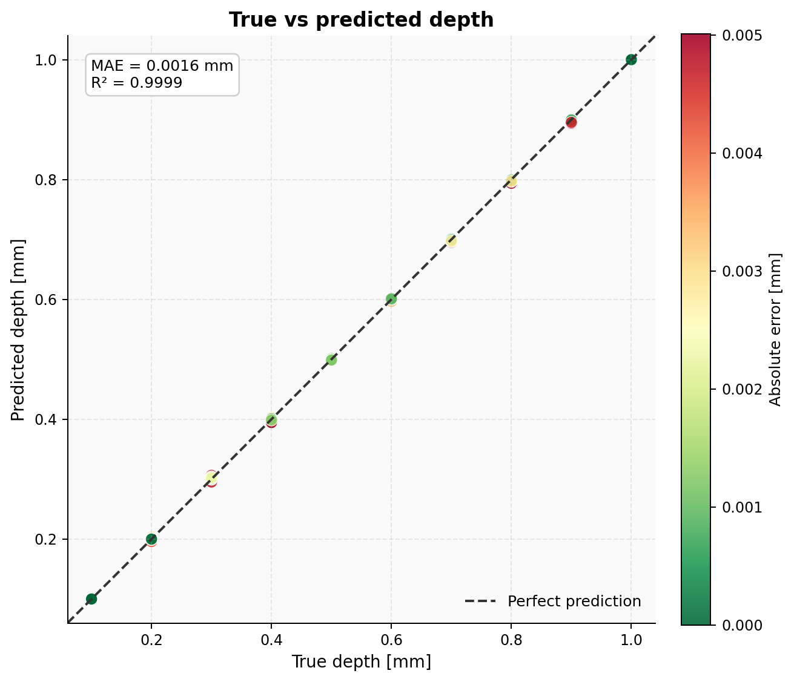
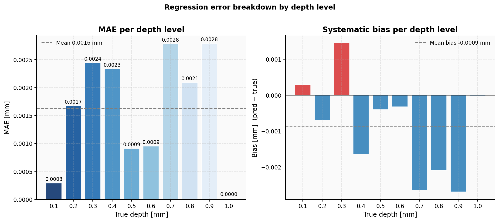

# Benchmark Results — Airborne Acoustics (Current)

All results are on **airborne sound only**. Structure-borne and fused results
will be added as those pipelines are completed.

Evaluation is deliberately strict: holdout sets consist of **complete plate
runs** (all 49 holes from a run), never individual holes mixed into training.
This means the model never sees the acoustic signature of a run during
training, which is the only evaluation protocol that reflects real deployment.

---

## Classical ML — ExtraTrees Regressor

**Feature set:** 20 features selected via inverted-cone pipeline (Spearman,
MI, ElasticNet, ExtraTrees consensus ranking) from a 192 kHz airborne signal.  
**Holdout:** 7 complete plate runs, 343 holes, fully excluded from all training
and feature selection.

| Metric | Value |
|--------|-------|
| MAE | **0.032 mm** |
| RMSE | 0.046 mm |
| R² | 0.975 |
| P50 abs error | 0.021 mm |
| P90 abs error | 0.071 mm |
| P95 abs error | 0.093 mm |
| Bias (mean residual) | −0.003 mm |
| Goal < 0.05 mm MAE | ✓ met |
| MAE as fraction of DOE step (0.1 mm) | 31.9 % |

Nested grouped CV (all 31 runs, 5 outer folds) gives MAE = **0.056 mm** —
the honest cross-validated upper bound before any holdout optimism.

### Key plots

**Predicted vs true depth**  

**Absolute error by depth level**  

**MAE heatmap — run × depth level**  
Shows which run/depth combinations are hardest. Worst runs
(`0503_3_1_0862`, `0503_2_1_5344`) still stay below 0.055 mm MAE.  

**Model comparison — nested CV leaderboard**  

**Top-20 feature importances**  
Selected features span temporal centroid, sub-500 Hz band ratio, DWT
detail coefficients (cD3, cD7), short-time crest/skewness/kurtosis range,
and CWT surface AE proxy — consistent with the physical expectation that
depth correlates with chip formation dynamics and structural vibration
damping rather than raw amplitude.  

---

## Deep Learning — SpecResNet Regression

**Architecture:** Spectral ResNet with log-Mel frontend (48 kHz, 128 mel
bins, 0.5 s sliding windows, 0.25 s hop).  
**Training:** 29 plate runs. 2 runs held out completely and never seen during
any phase of training, validation, or hyperparameter selection.

### Fully unseen holdout (2 complete plate runs, 98 holes)

| Metric | Value |
|--------|-------|
| MAE | **0.002 mm** |
| RMSE | 0.002 mm |
| R² | 0.9999 |
| P90 abs error | 0.004 mm |
| Step accuracy (±0.05 mm) | 100 % |
| Bias | −0.001 mm |

**Predicted vs true — unseen runs**  

**Error by depth level — unseen runs**  

### Augmented test sets

| Test set | Description | MAE (mm) | R² | Step acc. |
|----------|-------------|----------|----|-----------|
| Viable | Audacity-augmented real signals | 0.014 | 0.980 | 88.6 % |
| Difficult | GPT-synthesised adversarial signals | 0.205 | 0.008 | 45.0 % |

The "difficult" set is intentionally adversarial — synthetically generated
signals designed to stress-test generalisation, not representative of real
measurement conditions. It establishes a lower-bound worst case.

---

## Summary

| Model | Evaluation | MAE (mm) | R² |
|-------|-----------|----------|----|
| ExtraTrees (classical) | 7-run grouped holdout | 0.032 | 0.975 |
| ExtraTrees (classical) | Nested CV (OOF, 31 runs) | 0.056 | — |
| SpecResNet (DL) | 2-run fully unseen holdout | 0.002 | 0.9999 |
| SpecResNet (DL) | Viable augmented | 0.014 | 0.980 |
| SpecResNet (DL) | Difficult adversarial | 0.205 | 0.008 |

The DOE step size is **0.1 mm**. Classical MAE of 0.032 mm = 32 % of one
step. DL MAE of 0.002 mm on unseen runs = 2 % of one step, suggesting the
model has learned a robust depth-acoustic mapping rather than run-specific
artefacts.

---

## Planned additions

- Structure-borne acoustic results (pipeline in progress)
- Fused airborne + structure-borne ensemble results
- Classification accuracy table (10-class, DL head)
- Uncertainty calibration plots (predicted σ vs actual error)
